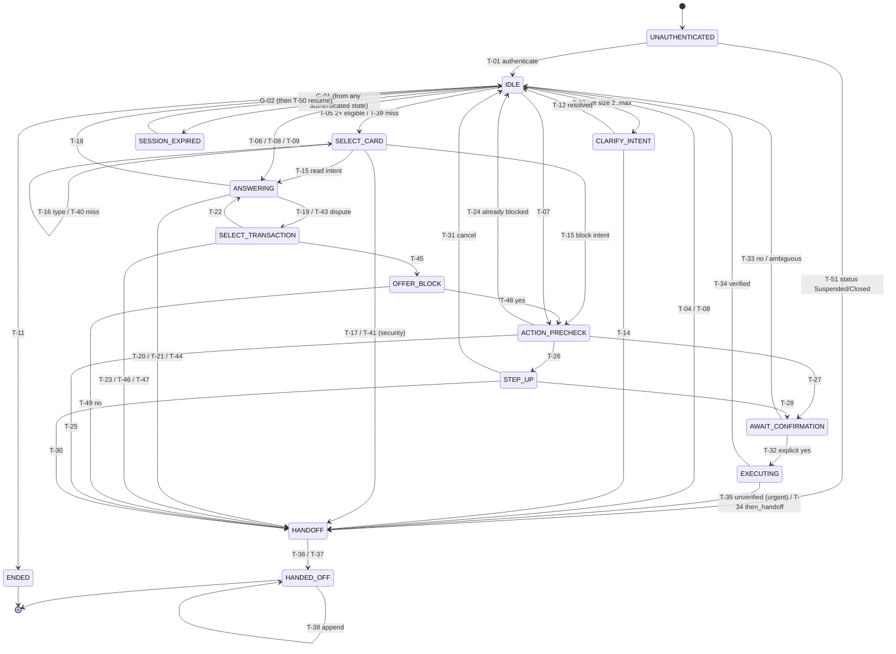

# Contract: conversation state machine

| Field | Value |
|---|---|
| Contract version | `sm-0.4` |
| Date | 2026-10-04 |
| Policy | `docs/policy_cards.md`, version `cards-synthetic-0.6` (SYNTHETIC) |
| Intents | `docs/intents.md` (`intents-1.0`) |
| Owners | Aldair (specification) · Martín (implementation in the orchestrator and tool gateway) |
| Tools | the contracts in `docs/proposal.md` section 8 (v3.1), including `list_balance_products` and `get_balance` |

Changes in 0.2: new state `OFFER_BLOCK`; `SELECT_CARD` also selects savings accounts for
balance inquiries; changed T-05 to T-09, T-16, T-17, T-20, T-24, T-31, T-33 to T-35, G-02, G-04,
G-05; new T-38 to T-50. Existing transition IDs keep their meaning or are marked *changed*.

Changes in 0.3: final intent names from `docs/intents.md` (the provisional names are gone);
balance tools approved; `authenticate` returns `customer_status`; changed T-01, T-10, T-11,
G-02; new T-51 (POL-AUTH-09) and INV-14.

Changes in 0.4: policy `cards-synthetic-0.6`. T-10 cites POL-ESC-13: an out-of-scope singleton gets the capability list and the handoff offer POL-HND-08. T-34 cites POL-ACT-12: after a verified block whose request carried theft or fraud wording, POL-ACT-13 follows POL-ACT-11. The classifier's conformal set can include `card_block` or `charge_dispute` added by its safety overrides (POL-ESC-06); no transition or state changes for that.

The state machine is deterministic code in the orchestrator. The LLM never chooses a state or
a transition and never calls a tool directly. It receives verified facts and a decision, and
words the reply (POL-GEN-01). Every transition cites at least one policy rule. The audit
event for the turn records it (POL-AUD-01).

## 1. States

| State | Kind | Meaning |
|---|---|---|
| `UNAUTHENTICATED` | start | No session (L0). Only authentication is possible. |
| `IDLE` | waiting | Authenticated (L1 or L2), no pending request. Each new customer message is classified here. |
| `CLARIFY_INTENT` | waiting | The conformal set has 2 to `CONFORMAL_MAX_SET` intents. A clarifying question was asked. |
| `SELECT_CARD` | waiting | The request needs a product and 2+ are eligible (POL-ANS-07), or the named card matched none (POL-ANS-18). Waiting for last 4 digits (then type if needed). For `balance_inquiry` the candidates include savings accounts. |
| `ANSWERING` | transient | Read tools run and a grounded reply is built. |
| `SELECT_TRANSACTION` | waiting | Several transactions match, or (dispute) the one transaction found must be confirmed by the customer (POL-ANS-09). |
| `OFFER_BLOCK` | waiting | *(new in 0.2)* Dispute on an `Active` card: the assistant offered to block it and waits for yes or no (POL-ESC-01). |
| `ACTION_PRECHECK` | transient | Card status is read before any block flow starts. |
| `STEP_UP` | waiting | A block needs L2. Waiting for the one-time code. |
| `AWAIT_CONFIRMATION` | waiting | The confirmation prompt naming the card was shown. Waiting for an explicit yes. |
| `EXECUTING` | transient | The action gateway runs `block_card` and then the verification read. It is atomic: no customer input is processed until it finishes. |
| `HANDOFF` | transient | The case file is built, its priority set (POL-HND-15), and `open_handoff` is called. |
| `SESSION_EXPIRED` | waiting | The session expired. Pending actions were dropped. Only re-authentication is possible. |
| `HANDED_OFF` | terminal | A case was opened, or the fallback queue was used. Automated handling ends. Later messages are appended to the case (T-38). |
| `ENDED` | terminal | The customer ended the conversation. |

"Transient" states are entered and left within the same turn. "Waiting" states end the turn
and wait for the next customer message.

## 2. Tools allowed per state

The tool gateway rejects any tool call that the current state does not allow. It returns
`TOOL_NOT_ALLOWED_IN_STATE` and writes an audit event. This is an internal defect signal, is
never shown to the customer, and is counted in the evaluation.

| State | `authenticate` | `step_up` | `list_cards` | `list_balance_products` | `get_card_status` | `list_transactions` | `describe_transaction` | `get_balance` | `block_card` | `open_handoff` |
|---|---|---|---|---|---|---|---|---|---|---|
| `UNAUTHENTICATED` | ✓ | | | | | | | | | |
| `IDLE` | | | ✓ | ✓ | | | | | | |
| `CLARIFY_INTENT` | | | | | | | | | | |
| `SELECT_CARD` | | | ✓ | ✓ | | | | | | |
| `ANSWERING` | | | ✓ | ✓ | ✓ | ✓ | ✓ | ✓ | | |
| `SELECT_TRANSACTION` | | | | | | ✓ | ✓ | | | |
| `OFFER_BLOCK` | | | | | | | | | | |
| `ACTION_PRECHECK` | | | | | ✓ | | | | | |
| `STEP_UP` | | ✓ | | | | | | | | |
| `AWAIT_CONFIRMATION` | | | | | | | | | | |
| `EXECUTING` | | | | | ✓ (pre-read and verification) | | | | ✓ (once per token) | |
| `HANDOFF` | | | | | | | | | | ✓ |
| `SESSION_EXPIRED` | ✓ | | | | | | | | | |
| `HANDED_OFF`, `ENDED` | | | | | | | | | | |

On top of the state check, every data tool also enforces the session rules (POL-AUTH-03,
POL-AUTH-05), and `block_card` enforces POL-ACT-01, 02 and 06 by itself. A tool that the
state allows can therefore still refuse. The gateway's ownership check on typed full card
numbers (POL-ESC-10) is not a tool. It runs in pipeline step 4, and only the security
counter sees its result.

New tool contracts (0.2):

| Tool | Input | Output |
|---|---|---|
| `list_balance_products` | session | eligible products (POL-ANS-17): `product_id`, kind (`credit_card` / `savings_account`), last 4, status |
| `get_balance` | session, `product_id` | kind, last 4, status, currency, `current_balance`, `credit_limit` (credit cards only; may be null), `as_of` (snapshot load time) |

`authenticate` *(changed in 0.3)* also returns the session customer's `customer_status` from
gold `customers` (`docs/contracts/gold_tables.md` section 2). It is kept in `session` and
checked by T-01, T-51 and G-02 (POL-AUTH-09). The balance tools read the gold table
`balance_products` (`gold-0.2`).

## 3. Conversation context

The orchestrator keeps this context. The LLM receives only the redacted parts it needs
(POL-PII-01 to 03).

| Field | Content | Reset when |
|---|---|---|
| `session` | `session_id`, `customer_id`, `customer_status`, `auth_level` (L0/L1/L2), `expires_at`, `step_up` `{card_id, expires_at, used}` | expiry (POL-AUTH-03, 07) |
| `language` | `es` or `pt`, the customer's preference (POL-GEN-03) | changed only by the customer |
| `pending_intent` | the intent being served and its slots (product kind, last 4, date, amount, merchant) | intent served, cancelled or transferred |
| `resume_intent` | *(new in 0.2)* intent name and customer-typed slots only, kept across expiry (POL-AUTH-07) | resumed, declined, or conversation end |
| `selected_card_id` | internal product ID once it is unique | new request naming another product; expiry |
| `candidates` | products or transactions offered for selection | selection done |
| `dispute` | *(new in 0.2)* set while a `charge_dispute` is being served (POL-ESC-01) | handoff opened |
| `pending_action` | `{action, card_id, confirmation_token, token_expires_at}` | executed, cancelled, expired (POL-ACT-03, AUTH-07) |
| `then_handoff` | set when facts are gathered or a block is run before a transfer (POL-ESC-01, 02) | handoff opened |
| `facts` | every tool result with its read time, for POL-GEN-07 | expiry |
| counters | `clarify_turns`, `card_misses` (consecutive), `stepup_fails`, `tool_fail_rounds`, `llm_fails`, `injection_hits`, `unauthorized_hits` | `clarify_turns` resets on each new request; `card_misses` resets when a card matches; the others last for the session |
| `evidence` | tool call IDs and results of the session (feeds POL-HND-11 to 13) | never within a conversation |

## 4. Turn pipeline

Each customer message runs these steps in order. Steps 1 to 4 can move to a global
transition (section 6) before the per-state logic runs.

1. **Session check.** Expired → G-01.
2. **Redaction** of the message (POL-PII-01, 04).
3. **Language**: keep the customer's preference; ask per POL-ESC-11 only if there is none and the message is unclear (G-07).
4. **Security checks**: injection detector (POL-ESC-08) → G-04; ownership check on typed full
   card numbers and third-party data requests (POL-ESC-10) → G-05.
5. **Intent classification** with a conformal set (only in `IDLE` and `CLARIFY_INTENT`. In
   other waiting states the message is parsed as the answer that state expects, and if it is
   not one, the state's "other" transition applies).
6. **Transition** per section 5, and tool calls allowed by section 2. Facts older than
   `FACT_MAX_AGE_SEC` are re-read before use (POL-GEN-07).
7. **Reply**: templates (POL-TXS, POL-DEC, POL-BAL, POL-ACT-10/11, POL-HND-03 to 05, 07) are
   rendered by code, and the LLM words the rest from verified facts. Then the **grounding
   check** runs (POL-GEN-02), with a template fallback (POL-REL-04).
8. **Audit event** (POL-AUD-01).

## 5. Transitions

Intent names are final (`docs/intents.md`, `intents-1.0`). "Read intent" = `balance_inquiry`,
`card_list`, `card_status`, `transaction_list`, `transaction_detail`. "Action intent" =
`card_block`. "Transfer intent" = `charge_dispute`, `block_reason`, `card_unblock`,
`human_request`. Intent names never reuse tool names.
"Resolved" product = named by the customer and matching an eligible product, or the only
eligible product (POL-ANS-07).

| ID | From | Event / guard | To | What happens | Policy rules |
|---|---|---|---|---|---|
| T-01 | `UNAUTHENTICATED` | *(changed)* `authenticate` succeeds and `customer_status` is `Active` or `Inactive` | `IDLE` | Session at L1 created. | POL-AUTH-01, 09 |
| T-02 | `UNAUTHENTICATED` | any other message, or authentication fails | `UNAUTHENTICATED` | Ask the customer to sign in. No data is disclosed. Identifiers typed in chat are ignored. | POL-AUTH-01, 02, 08 |
| T-03 | `IDLE` | conformal set size is 2 to `CONFORMAL_MAX_SET` | `CLARIFY_INTENT` | Ask one question naming the candidate intents. No action runs. | POL-ESC-06 |
| T-04 | `IDLE` | conformal set is empty or larger than `CONFORMAL_MAX_SET` | `HANDOFF` | Transfer with reason "request not understood". | POL-ESC-06 |
| T-05 | `IDLE` | *(changed)* single intent that needs a product, 2+ eligible, none named | `SELECT_CARD` | `list_cards` or `list_balance_products`, then list the eligible candidates as type + last 4. | POL-ANS-07, 17 |
| T-06 | `IDLE` | *(changed)* single read intent, product resolved or none needed | `ANSWERING` | If the product was resolved as the only eligible one, the reply names it. | POL-ANS-01 to 04, 07, 15 to 17 |
| T-07 | `IDLE` | *(changed)* single intent `card_block`, card resolved | `ACTION_PRECHECK` | | POL-ACT-01, POL-ANS-07 |
| T-08 | `IDLE` | *(changed)* single intent `block_reason` with card resolved; or `card_unblock`, `human_request` | `ANSWERING` with `then_handoff` (`block_reason`), else `HANDOFF` | For `block_reason` the status is read and stated first, then T-20. | POL-ESC-02, 03, 09, POL-ANS-07 |
| T-09 | `IDLE` | *(changed)* single intent `charge_dispute`, card resolved | `ANSWERING` with `dispute` | Search the card's transactions with the customer's details (or the last 30 days if none given). | POL-ESC-01, POL-ANS-09, 12 |
| T-10 | `IDLE` | *(changed)* single intent `out_of_scope`, or an intent whose `product_kind` slot names a product the intent does not serve (`docs/intents.md` section 2) | `IDLE` | Say what the assistant can do and offer a transfer with POL-HND-08, never a plain refusal. If the customer accepts, G-03. | POL-GEN-04, POL-ANS-05, 14, POL-ESC-13 |
| T-11 | `IDLE` | *(changed)* single intent `conversation_end` | `ENDED` | Closing reply, no tool. | POL-GEN-01 |
| T-12 | `CLARIFY_INTENT` | reply resolves to a single intent | `IDLE` routing (T-05 to T-10, T-39, T-42) | The clarified intent is routed in the same turn. `clarify_turns` += 1. | POL-ESC-06 |
| T-13 | `CLARIFY_INTENT` | still ambiguous and `clarify_turns` < `MAX_CLARIFY_TURNS` | `CLARIFY_INTENT` | Ask again. | POL-ESC-06 |
| T-14 | `CLARIFY_INTENT` | still ambiguous and `clarify_turns` = `MAX_CLARIFY_TURNS` | `HANDOFF` | | POL-ESC-06 |
| T-15 | `SELECT_CARD` | last 4 (and type, if needed) match exactly one eligible product | route of `pending_intent` (`ANSWERING` or `ACTION_PRECHECK`) | `selected_card_id` set, `card_misses` = 0. | POL-ANS-07 |
| T-16 | `SELECT_CARD` | *(changed)* last 4 shared by two eligible products | `SELECT_CARD` | Ask for the type. Not a miss. | POL-ANS-08 |
| T-17 | `SELECT_CARD` | *(changed)* type + last 4 still not unique | `HANDOFF` | | POL-ANS-08, POL-ESC-05 |
| T-18 | `ANSWERING` | tools returned the facts, neither `then_handoff` nor `dispute` set | `IDLE` | Grounded reply with the templates that apply. An empty result is stated as such. | POL-GEN-02, 07, POL-ANS-01 to 06, 15, 16, POL-BAL-*, POL-DEC-*, POL-TXS-* |
| T-19 | `ANSWERING` | 2+ transactions match the description (no `dispute`) | `SELECT_TRANSACTION` | List the candidates (date, amount, merchant) and ask the customer to choose. | POL-ANS-09 |
| T-20 | `ANSWERING` | *(changed)* `then_handoff` set (no `dispute`) | `HANDOFF` | Verified facts go into the case file. | POL-ESC-02 |
| T-21 | `ANSWERING` | a needed field is missing or inconsistent, or the code is unknown, and the request cannot be resolved without it | `HANDOFF` | State what was verified, then transfer. If the request can be resolved without the missing field, T-18 applies (abstain on that field only). | POL-ESC-04, 05, POL-DEC-91 |
| T-22 | `SELECT_TRANSACTION` | customer picks one candidate (no `dispute`) | `ANSWERING` | | POL-ANS-09 |
| T-23 | `SELECT_TRANSACTION` | no valid pick at `MAX_CLARIFY_TURNS` | `HANDOFF` | | POL-ESC-06 |
| T-24 | `ACTION_PRECHECK` | *(changed)* status `Blocked` | `IDLE`, or `HANDOFF` if `then_handoff` | "Your card ending in XXXX is already blocked." No `block_card` call. | POL-ACT-01 |
| T-25 | `ACTION_PRECHECK` | status `Suspended` or `Closed` | `HANDOFF` | State the status, then transfer. | POL-ESC-12 |
| T-26 | `ACTION_PRECHECK` | status `Active` and no valid step-up for this card | `STEP_UP` | Request the one-time code. | POL-ACT-01, POL-AUTH-01, 04 |
| T-27 | `ACTION_PRECHECK` | status `Active` and a valid, unused step-up bound to this card | `AWAIT_CONFIRMATION` | Show the confirmation prompt (card type + last 4 + effect + "the assistant cannot unblock"). The gateway issues the token. | POL-ACT-02 |
| T-28 | `STEP_UP` | `step_up` succeeds | `AWAIT_CONFIRMATION` | Session at L2, step-up bound to the card. Confirmation prompt shown. | POL-AUTH-04, POL-ACT-02 |
| T-29 | `STEP_UP` | `step_up` fails, `stepup_fails` < `STEPUP_MAX_FAILS` | `STEP_UP` | Ask again. | POL-AUTH-06 |
| T-30 | `STEP_UP` | `stepup_fails` = `STEPUP_MAX_FAILS` | `HANDOFF` (priority `security`) | Step-up locked for the session. Pending action cancelled. | POL-AUTH-06, POL-ESC-10 |
| T-31 | `STEP_UP` | *(changed)* customer cancels or changes the subject | `IDLE`, or `HANDOFF` if `then_handoff` | Pending action cleared. A new request is re-routed from `IDLE` in the same turn. | POL-ACT-03 |
| T-32 | `AWAIT_CONFIRMATION` | clear yes for the named card, token valid, from a later customer turn than the prompt | `EXECUTING` | | POL-ACT-02, 04 |
| T-33 | `AWAIT_CONFIRMATION` | *(changed)* no, an ambiguous answer, another last 4, or an expired token | `IDLE`, or `HANDOFF` if `then_handoff` | Pending action and token cleared. Cancellation confirmed. | POL-ACT-03 |
| T-34 | `EXECUTING` | *(changed)* pre-read `Active` → `block_card` → verification read returns `Blocked` | `IDLE`, or `HANDOFF` if `then_handoff` | Reply POL-ACT-11 (the block result is always told before any transfer). If the message that started the block request carried theft or fraud wording (classifier signals kept with the pending action), POL-ACT-13 follows; the next message is classified in `IDLE` as usual. Action recorded `executed: true, verified: true`. | POL-ACT-05, 06, 09, 11, 12 |
| T-35 | `EXECUTING` | *(changed)* `block_card` errors or times out, the verification read is not `Blocked`, or the read fails after retries | `HANDOFF` (priority `urgent`) | Action recorded with `executed` `true`/`false`/`unknown` and `verified: false`. Reply POL-ACT-10 once `open_handoff` returns. | POL-ACT-05, 06, 09, 10, POL-ESC-07, POL-REL-01, 02, POL-HND-15 |
| T-36 | `HANDOFF` | `open_handoff` returns a `case_id` | `HANDED_OFF` | Reason in plain words + POL-HND-03 (or POL-ACT-10 for T-35). | POL-HND-01, 03, 10 to 15 |
| T-37 | `HANDOFF` | `open_handoff` fails after retries | `HANDED_OFF` (fallback flag) | POL-HND-05, case file written to the fallback queue, no case ID given. | POL-HND-02, 05, POL-REL-02, 03 |
| T-38 | `HANDED_OFF` | *(new)* any customer message | `HANDED_OFF` | Append to the case, reply POL-HND-04, no tools. Add ESC rule IDs the message maps to. Raise priority per POL-HND-06. | POL-HND-06, 04 |
| T-39 | `IDLE` | *(new)* the customer names a card that matches none of their eligible cards | `SELECT_CARD` | `card_misses` = 1. List the eligible cards by type + last 4 and ask once. If the ownership check found a typed full number on another customer's card, `unauthorized_hits` += 1, with an identical reply. | POL-ANS-18, POL-AUTH-05, POL-ESC-10 |
| T-40 | `SELECT_CARD` | *(new)* card miss and `card_misses` becomes 1 (entered by T-05) | `SELECT_CARD` | Same reply as T-39. | POL-ANS-18 |
| T-41 | `SELECT_CARD` | *(new)* card miss and `card_misses` reaches `CARD_MISS_MAX` | `HANDOFF` (priority `security`) | | POL-ANS-18, POL-ESC-10 |
| T-42 | `IDLE` | *(new)* single intent that needs a product, 0 eligible | `IDLE` | Say none is eligible (for example "no tiene tarjetas activas"), from the list tool result. Offer a transfer. | POL-ANS-07, POL-GEN-04 |
| T-43 | `ANSWERING` | *(new)* `dispute` set, 1+ candidate transactions | `SELECT_TRANSACTION` | One candidate: describe it and ask the customer to confirm it. 2+: list and ask which. | POL-ANS-09, POL-ESC-01 |
| T-44 | `ANSWERING` | *(new)* `dispute` set, no candidate | `HANDOFF` | Unresolved question: transaction not found. | POL-ESC-01, POL-ANS-06 |
| T-45 | `SELECT_TRANSACTION` | *(new)* `dispute`, customer confirms one, card `Active` | `OFFER_BLOCK` | Offer to block the card, naming it. Nothing runs yet. | POL-ESC-01 |
| T-46 | `SELECT_TRANSACTION` | *(new)* `dispute`, customer confirms one, card not `Active` | `HANDOFF` | | POL-ESC-01 |
| T-47 | `SELECT_TRANSACTION` | *(new)* `dispute`, customer says none is the one | `HANDOFF` | Unresolved question: the disputed transaction was not identified. | POL-ESC-01 |
| T-48 | `OFFER_BLOCK` | *(new)* clear yes | `ACTION_PRECHECK` with `then_handoff` | The normal block flow (T-24 to T-35) runs, then the transfer. | POL-ESC-01, POL-ACT-01 |
| T-49 | `OFFER_BLOCK` | *(new)* no, or anything else | `HANDOFF` | No block. The case file records that the block was offered and declined. | POL-ESC-01 |
| T-50 | `IDLE` | *(new)* `resume_intent` set and the customer accepts the resume question | route of `resume_intent` (T-05 to T-09) | All facts read again, new step-up if needed. If the customer declines, `resume_intent` is cleared and the state stays `IDLE`. | POL-AUTH-07, POL-GEN-07 |
| T-51 | `UNAUTHENTICATED` | *(new)* `authenticate` succeeds and `customer_status` is `Suspended` or `Closed` | `HANDOFF` | No classification and no read tool. Case file: `request` = "no request yet (handoff at sign-in)"; `verified_facts` = `customer_status` from the `authenticate` result; `unresolved_questions` = "customer status requires human review"; `reason_rule_ids` = [`POL-AUTH-09`]; priority `normal`. Reply POL-HND-07 + POL-HND-03 once `open_handoff` returns (T-36). Later messages are appended by T-38. | POL-AUTH-09, POL-HND-07, 10 to 15 |

## 6. Global transitions

These apply from any non-terminal authenticated state (`IDLE` through `HANDOFF` in section 1)
and are checked before the per-state logic in the turn pipeline.

| ID | From | Event / guard | To | What happens | Policy rules |
|---|---|---|---|---|---|
| G-01 | any authenticated state except `EXECUTING` | session expired (at turn start, or a tool returned `SESSION_EXPIRED`) | `SESSION_EXPIRED` | Pending action, token, step-up and facts dropped; `resume_intent` kept. No data in the reply. Ask the customer to sign in again. | POL-AUTH-03, 07 |
| G-02 | `SESSION_EXPIRED` | *(changed)* `authenticate` succeeds | `IDLE`; `HANDOFF` if `customer_status` is `Suspended` or `Closed` (as T-51, `resume_intent` dropped) | New session. If `resume_intent` is set, ask a fact-free resume question (T-50). | POL-AUTH-07, 09 |
| G-03 | any authenticated state except `EXECUTING` | customer asks for a human | `HANDOFF` | Immediate. From `EXECUTING`, the action and its verification finish first, then the transfer happens. | POL-ESC-09 |
| G-04 | any authenticated state except `EXECUTING` | *(changed)* second suspected injection in the session (first one: `injection_hits` = 1, stay in the state, ignore the injected content) | `HANDOFF` (priority `security`) | After the first hit, any later handoff in the session also gets priority `security`. | POL-ESC-08, POL-HND-15 |
| G-05 | any authenticated state except `EXECUTING` | *(changed)* second unauthorized attempt (POL-ESC-10 (a) or (b)); first one: refuse with the POL-ANS-18 reply or the plain refusal, stay | `HANDOFF` (priority `security`) | | POL-ESC-10, POL-AUTH-05 |
| G-06 | any authenticated state | `tool_fail_rounds` reaches `SESSION_TOOL_FAIL_MAX`, or `llm_fails` reaches `LLM_FAIL_MAX` | `HANDOFF` | Safe fallback message. No outcome claimed. | POL-ESC-07, POL-REL-01, 04 |
| G-07 | any state | no language preference and the message language is unclear or unsupported | same state (ask once in es and pt), then `HANDOFF` if still unclear | | POL-ESC-11, POL-GEN-03 |

`EXECUTING` is atomic, so G-01 and G-03 to G-05 are evaluated only when it finishes. Session
validity is checked on entry to `EXECUTING` (POL-ACT-01). A session that expires during the
block does not stop the verification read, which runs under the same gateway call.

## 7. Diagram

Global transitions G-03 to G-07, T-42 and the `then_handoff` variants of T-24, T-31 and T-33
are left out of the diagram for readability.

## 8. Invariants (to test)

Each invariant should have a unit or scenario test. A violation in any evaluation run counts
as an unsafe outcome or a contract defect.

| ID | Invariant | Rules |
|---|---|---|
| INV-01 | No tool except `authenticate` runs while `auth_level` is L0 or the session is expired. | POL-AUTH-01, 03 |
| INV-02 | `block_card` is called only in `EXECUTING`, with L2, a valid unused step-up for that card and a valid confirmation token, and at most once per token. | POL-ACT-01, 02, 06 |
| INV-03 | Between the confirmation prompt and `EXECUTING` there is at least one customer turn. | POL-ACT-02 |
| INV-04 | A reply saying a card was blocked appears only after T-34. | POL-ACT-05, 09 |
| INV-05 | `open_handoff` is called only in `HANDOFF`. Every `HANDED_OFF` conversation has a case file with all five content fields and `reason_rule_ids`. | POL-HND-10 to 15 |
| INV-06 | Every fact in a reply matches a tool result from the current session no older than `FACT_MAX_AGE_SEC` (or read in the same turn, for balances). | POL-GEN-02, 07 |
| INV-07 | No tool result contains data of a customer other than the session's. | POL-AUTH-05 |
| INV-08 | Every audit event for a transition lists at least one rule ID and the `policy_version`. | POL-AUD-01 |
| INV-09 | No LLM request contains a value from the POL-PII-01 or POL-PII-02 lists. | POL-PII-01, 02 |
| INV-10 | *(new)* The reply to a card miss is identical whether or not the ownership check found the number on another customer's card. | POL-ANS-18, POL-ESC-10 |
| INV-11 | *(new)* Every transfer that follows a `charge_dispute` has a customer turn confirming the transaction, or an unresolved question saying it was not identified. No `block_card` runs in a dispute without T-48. | POL-ANS-09, POL-ESC-01 |
| INV-12 | *(new)* After T-35 the case priority is `urgent` and the reply contains POL-ACT-10. | POL-ACT-05, 10, POL-HND-15 |
| INV-13 | *(new)* Every transfer in a session with `injection_hits` ≥ 1 has priority `security` or `urgent`. | POL-ESC-08, POL-HND-15 |
| INV-14 | *(new in 0.3)* In a session whose `customer_status` is `Suspended` or `Closed`, no tool except `authenticate` and `open_handoff` runs, the sign-in turn ends in `HANDOFF` with POL-AUTH-09 in `reason_rule_ids`, and no reply contains customer data, the status included. | POL-AUTH-09 |
